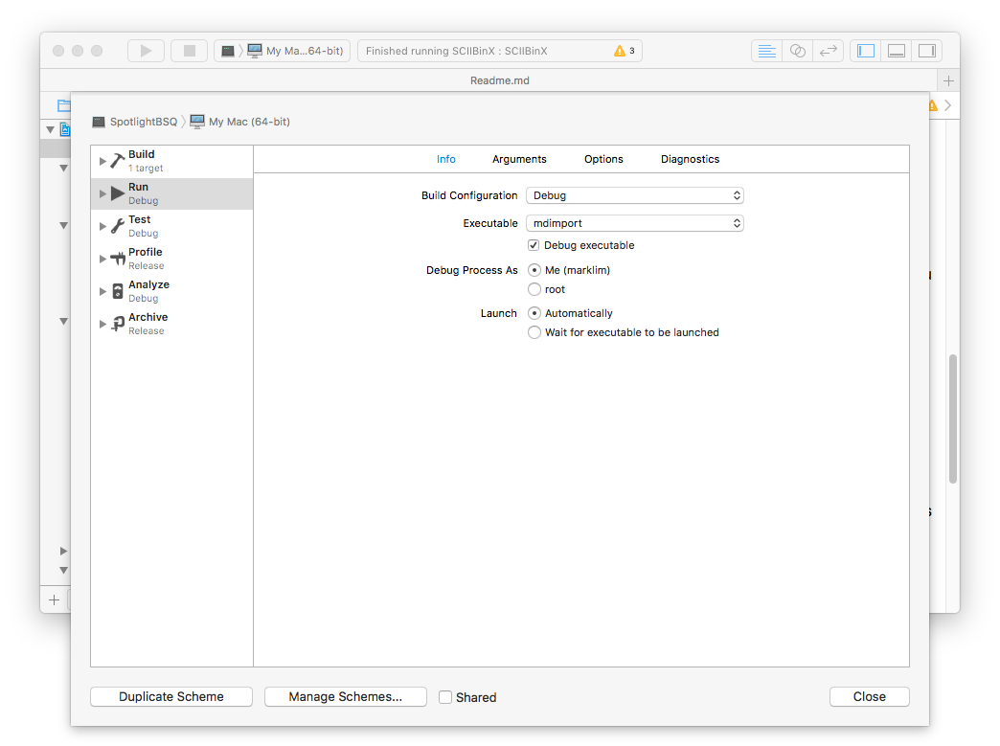

## Extracting an Apple II/IIGS program or file from a BinSCII file

In the early days of the Internet when download speeds were slow and programs not bloated, many demos and programs were distributed via emails and through user groups. Many encryption schemes with the primary aim of preserving file integrity as well as compressing the file data were developed. These encoding algorithms like Huffman, LZ77, ARC, Arithmetic Coding etc. were invented. (Referernce: The Data Compression Book by Mark Nelson and Jean-Loup Gaily)

In 1992, BinSCII was developed to help distribute AppleII programs via emails. The proposed scheme uses printable ASCII characters to encode (and decode) Apple II files in particular preserving the file attributes of ProDOS programs. However, it cannot handle the resource forks of Apple IIGS files. Programs like ShrinkIt and GS-ShrinkIt (based on LZW2 compression) developed by Andy Nicholas became the standard for archiving Apple II/IIGS programs. 

The decoder of this program **SCIIBinX** is based on the decoding suggested by Todd Whitesel. Refer to the Documentation folder for details on the format of **BinSCII** files. To facilitate the decoding of such files on the macOS, the program recognises two file extensions viz. **BSC** and **BSQ**. Usually **BSQ** files encode a ShrinkIt Archive whereas **BSC** files encode a single AppleII program or data file. These files are actually *TEXT* files with a special header *FiLeStArTfIlEsTaRt*. **SCIIBinX** can process email text files embedded with one or more of this kind of block. It can also dealt with ProDOS files encoded as *segments* and written out as separate **BSC** or **BSQ** files.

The program can change the file extension of any *TEXT* file to **BSC** or **BSQ** by selecting the menu item "Change File Extension..."  under its **File** menu to bring up a panel. Multiple items can be selected.

Finally, selecting the menu item **SCIIBin Help** under the program's **Help** Menu will open and display the "ReadMe.rtf" file using Apple's **TextEdit** program. 

## Debugging the QuickLook and Spotlight Plugins.

Unfortunately, Apple has never updated their documentation on debugging these two kind of plugins. Given below are brief details on how to debug the QuickLook plugin of the program.       

If you are debugging under XCode 4.x or later, click on the **"Edit Scheme"** Menu and select the "Edit Scheme..." menu item. In the **Info** pane, click on Popup menu labelled *Executable* and then select menu item *Other...*. Another panel labelled *Choose an executable to launch* will be displayed. To navigate to the folder **/usr/bin**, type Shift+Open-Clover+g. Yet another panel labelled "Go to the folder" will appear. Click on the Text Edit Control and type **/usr/bin**. Choose the executable file **qlmanage**. (Hint: type **ql**). Finally click on the **GO** button.

 
 

Next click on "Argument" pane and enter the following arguments to be passed to the executable **qlmanage**:

 
 

-g $(BUILD_DIR)/Release/QuickLookBSQ.qlgenerator
 
-c BSC
 
-p /Users/marklim/Desktop/Resources/SampleBSQs/Alias.BSC

**Note**: You have to set your own pathname to point at the correct disk location of the **BSC** or **BSQ** file.

 
 

To test the Spotlight plugin, repeat the steps above. The executable is "mdimport". And pass the following arguments.

-g $(BUILD_DIR)/Debug/SpotlightBSQ.mdimporter
 
-d2 /Users/marklim/Desktop/Resources/SampleBSQs/Alias.BSC

 
 
The Spotlight plugin will output to the console when the executable is run under XCode.

 
 

To view the options of **qlmanage** and **mdimport**, you have to open up a Terminal  window and at the command prompt, type: mdimport -h or qlmanage -h

